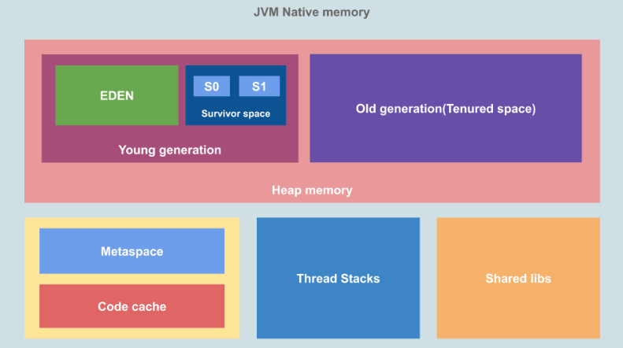
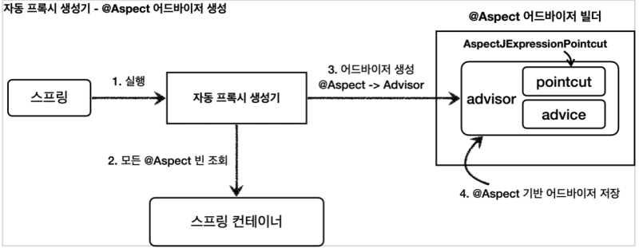
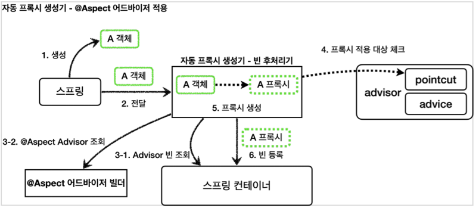

## Java, Spring

  
<h3>1. JVM이 정확히 무엇이고, 어떤 기능을 하는지 설명해 주세요.</h3>

    

      
답변

      
시스템 메모리를 관리하면서, 자바 기반 애플리케이션을 위해 이식 가능한 실행 환경을 제공합니다.

      
기능은 크게 2가지로 첫 번째로 자바 프로그램이 어느 기기나 OS 상에서도 실행될 수 있도록 하는 것이며 두 번째는 프로그램 메모리를 관리하고 최적화하는 것입니다.

      

        
꼬리 질문

        <ul>
        <li> 그럼 JVM은 어떤 실행 과정을 거치나요? 
          

            
답변

            
1. 프로그램이 실행되면, JVM은 OS로부터 메모리를 할당 받고 용도에 따라 여러 영억으로 나누어 관리합니다.

            
2. 자바 컴파일러가 소스코드를 읽고, 바이트코드(.class)로 변환 시킵니다.

            
3. 변경된 클래스 파일들을 클래스 로더를 통해 JVM 메모리 영역으로 로딩합니다.

            
4. 로딩된 클래스 파일들은 Execution engine을 통해 해석됩니다.

            
5. 해석된 바이트 코드는 메모리 영역에 배치되어 실질적인 수행이 이루어집니다. 이런 실행 과정 속 JVM은 필요에 따라 스레드 동기화나 가비지 컬렉션 같은 메모리 관리 작업을 수행합니다.

          

        </li>
        <li> 가비지 컬렉션이 뭔지 설명해 주세요.
          

            
답변

            
가비지 컬렉션은 Heap 영역에 있는 데이터들 중 불필요해진 데이터들을 자동으로 정리해주는 작업입니다.

            
실행 순서는 참조되지 않은 객체들을 탐색 후 삭제, 삭제된 객체의 메모리 반환 그리고 힙 메모리 재사용의 순서로 실행됩니다.

          

        </li>
        <li> 가비지 컬렉션의 Heap 영역의 구조에 대해 설명해 주세요.
          

            
답변

            
            
Heap 영역의 경우 크게 Young Generation과 Old Generation으로 나뉘어집니다.

            
인스턴스를 처음 생성하면 Young 영역의 메모리가 배정됩니다. 특히 그 중 맨 처음에는 Eden 영역에 할당이 됩니다. Eden 영역이 꽉 차서 더이상 할당이 불가능 하면 Minor GC에 의해 Eden 영역에 있는 요소의 참조 여부를 살피고 GC를 진행합니다. 이렇게 Young 영역에서 발생하는 GC를 Minor GC라고 부릅니다.

            
Minor GC를 통해 정리된 데이터들은 Survivor Space로 이동됩니다. Eden 영역과 S0, S1 영역중 하나에 대한 Minor GC의 결과물을 Minor GC가 진행되지 않은 Survivor Space에 옮겨놓고 기존 영역들을 정리하는 방식으로 S0, S1 영역중 하나의 영역에만 데이터가 존재하게 됩니다.

            
반복되는 과정 속에서 S0, S1 영역을 반복적으로 이동하는 데이터가 있을 수 있는데, 이런 이동을 거치며 age값이 증가하고, 특정 값 이상이 되면 Old Generation으로 데이터가 옮겨지게 됩니다. 이렇게 Young 영역에서 Old 영역으로 데이터가 옮겨지는 것을 Promotion이라고 합니다.

            
반복되는 Promotion으로 Old 영역에 데이터가 쌓이게 되고, Eden 영역과 같은 방식으로 GC를 통해 불필요한 요소를 제거하는 것을 Major GC라고 합니다.

          

        </li>
        <li> 그럼 어떤 방식으로 GC 대상을 파악하나요?
          

            
답변

            
기본적으로 Stop-The-World와 Mark & Sweep 알고리즘에 기초를 두고 있습니다.

            
먼저 GC를 하기 위해 모든 스레드를 중단시키는데, 이를 Stop-The-World라 칭합니다.

            
모든 스레드를 멈추고, 스택 내의 모든 지역 변수를 스캔하며 각각 어떤 오브젝트를 참조하고 있는지 찾는 과정이 Marking이고, 참조 되어있지 않은 오브젝트들을 Heap에서 제거 즉, Sweep 하게 됩니다. 이 방식을 Mark & Sweep이라 부릅니다.

          

        </li>
        <li> 자바 말고 다른 언어는 JVM 위에 올릴 수 없나요?
          

            
답변

            
자바 이외의 언어도 JVM에 올릴 수 있습니다. 예를 들어 Kotlin, Scala, Groovy 등의 언어가 있습니다.

          

        </li>
        <li> VM을 사용함으로써 얻을 수 있는 장점과 단점은 무엇인가요?
          

            
답변

            
장점으로는 플랫폼 독립성, 메모리 관리, 예외 처리, 다양한 라이브러리가 있습니다.

            
단점으로는 바이트 코드를 해석하고 실행하는 과정에서 성능저하가 발생할 수 있고, 프로그램 실행에 필요한 메모리를 동적으로 할당하고 해제하기 때문에 일부 시스템에서는 메모리 사용량에 부담이 가해질 수 있습니다.

          

        </li>
        <li> JVM과 내부에서 실행되고 있는 프로그램은 부모 프로세스 - 자식 프로세스 관계를 갖고 있다고 봐도 무방한가요?
          

            
답변

            
JVM은 OS 위에서 실행되는 프로그램이며, 내부에서는 스레드를 사용하여 동시에 여러 작업을 처리하기 때문에 부모 - 자식 프로세스 관계와는 다릅니다.

          

        </li>
        </ul>
      

    

  
<h3>2. final 키워드를 사용하면, 어떤 이점이 있나요?</h3>

    

      
답변

      
1. 변경 가능성을 최소화하여 예측 가능한 코드가 가능해집니다.

      
2. thread-safe하여 따로 동기화 할 필요가 없습니다.

      
3. setter-safe하여 외부에서 동적으로 값을 변경할 가능성이 줄어듭니다.

      
4. 런타임 시 JVM의 최적화를 통해 성능상 사소한 이점을 얻을 수 있습니다.

    

  
<h3>3. 인터페이스와 추상 클래스의 차이에 대해 설명해주세요.</h3>

    

      
답변

      
인터페이스는 모든 메소드가 추상 메소드로만 구성된 것을 의미하며 상속하는 클래스에서는 인터페이스에 존재하는 모든 추상 메소드를 구현해야 합니다.

      
추상 클래스는 추상메소드를 포함하고 있는 클래스를 의미합니다. 클래스 내부에 추상 메소드가 하나라도 있다면 클래스 앞에 abstract 키워드를 붙여야 합니다. 상속받은 클래스 역시 추상 메소드를 반드시 구현해야 합니다. 둘의 가장 큰 차이점은 인터페이스는 다중 상속이 가능하다는 것입니다.

      

      
꼬리질문

      <ul>
      <li> 인터페이스는 왜 다중 상속이 가능한가요?
          

            
답변

            
자바의 클래스는 다중상속을 지원하지 않기 때문입니다. 자바에서는 상위 클래스에 같은 이름의 메소드가 있다면 상속받은 하위클래스에서 그 메소드를 호출했을 때 어떤 메소드가 호출되어야 할지 알 수 없게되는 상황을 방지하기 위해 클래스의 다중상속을 지원하지 않습니다.

            
그러나 인터페이스는 하위 클래스에서 추상 메소드가 오버라이드 되어야 하기 때문에 위와 같은 문제에서 자유롭습니다. 결론적으로 추상클래스는 상속받은 클래스의 기능을 이용 및 확장하는 것이고, 인터페이스는 하위 클래스에게 일종의 설계도를 제공한다라는 것이 궁극적인 차이점이라고 할 수 있습니다.

          

        </li>
      </ul>
      

    

  
<h3>4. 리플렉션에 대해 설명해주세요.</h3>

    

      
답변

      
리플렉션은 구체적인 클래스 타입을 알지 못해도 그 클래스의 메소드, 타입, 변수들에 접근할 수 있도록 해주는 자바 API입니다.

      

      
꼬리질문

      <ul>
      <li> 그럼 어떤 경우에 사용이 가능할까요?
          

            
답변

            
코드 작성 시점에는 어떤 타입의 클래스를 사용할지 모르지만, 런타임 시점에 지금 실행되고 있는 클래스를 가져와서 실행해야 하는 경우에 사용됩니다. 인텔리제이의 자동완성, 스프링의 어노테이션이 리플렉션을 이용한 기능이라 할 수 있습니다.

          

        </li>
      </ul>
      

    

  
<h3>5. static에 대해 설명해주세요.</h3>

    

      
답변

      
static 키워드를 사용한 변수나 메소드는 클래스가 메모리에 올라갈 때 자동으로 생성되며 클래스 로딩이 끝나면 바로 사용할 수 있습니다. 즉 인스턴스 생성 없이 바로 사용 가능합니다. 모든 객체가 메모리를 공유한다는 특징이 있고, GC 관리 영역 밖에 있기 때문에 프로그램이 종료될 때까지 메모리에 값이 유지된 채로 존재하게 됩니다.

      

      
꼬리질문

      <ul>
      <li> 그럼 static은 왜 사용하나요?
          

            
답변

            
자주 변하지 않는 값이나 공통으로 사용되는 값 같은 공용자원에 대한 접근에 있어서 효율을 높일 수 있습니다. 또한 인스턴스 생성 없이 바로 사용 가능하기 때문에 프로그램 내에서 공통으로 사용되는 데이터들을 관리할 때 이용합니다.

          

        </li>
      </ul>
      

    

  
<h3>6. Error와 Exception의 차이를 설명해주세요.</h3>

    

      
답변

      
Error는 실행 중 일어날 수 있는 치명적 오류입니다. 컴파일 시점에 체크할 수 없고, 오류가 발생하면 프로그램은 비정상 종료되며 UncheckedException에 속합니다. 반면, Exception은 Error보다 비교적 경미한 오류이며, try-catch를 이용해 프로그램의 비정상 종료를 막을 수 있습니다.

      

      
꼬리질문

      <ul>
      <li> CheckedException과 UnCheckedException의 차이를 설명해주세요.
          

            
답변

            
CheckedException은 실행 전 예측 가능한 예외를 말하고, 예외 처리를 해야 합니다. 대표적인 Exception으로는 IO, ClassNotFound 등이 있습니다.

            
UnCheckedException은 실행하고 난 후에 알 수 있는 예외를 말하고, 따로 예외처리를 하지 않아도 됩니다. 대표적으로 NPE, ArrayIndexOutOfBoundE 등이 있습니다.

          

        </li>
        <li> 예외처리의 세 가지 방법에 대해 설명해주세요.
          

            
답변

            
예외가 발생한 메소드 내에서 직접 처리하는 방법, 예외가 발생한 메소드를 호출한 곳으로 예외 객체를 넘겨주는 방법 그리고, 사용자 정의 예외를 생성하여 처리하는 방법이 있습니다.

          

        </li>
      </ul>
      

    

  
<h3>7. Synchronized가 뭔지 설명해주세요.</h3>

    

      
답변

      
여러 개의 쓰레드가 한 개의 자원을 사용하고자 할 때, 현재 데이터를 사용하고 있는 쓰레드를 제외하고 나머지 쓰레드들은 접근을 막는 개념입니다. 데이터의 thread-safe를 보장하기 위해 자바의 Synchronized 키워드를 통해 멀티 쓰레드 환경에서 쓰레드간 동기화를 시킵니다. 다만 해당 키워드를 남발하게 되면 성능저하의 우려가 있습니다.

    

  
<h3>8. Stream이 뭔지 설명해주세요.</h3>

    

      
답변

      
Stream API는 자바8 부터 도입이 되었으며 일련의 데이터 요소인 배열이나 컬렉션 등의 데이터를 처리하기 위한 API입니다. 멀티 스레드를 활용해서 병렬로 연산을 수행할 수 있고, 내부 반복으로 연산을 수행하기 때문에 코드가 간결해지는 장점이 있습니다.

      

      
꼬리질문

      <ul>
        <li> Stream과 for ~ loop의 성능 차이를 비교해주세요.
          

            
답변

            
보통의 상황에선 for-loop의 성능이 더 좋습니다. 특히 원시타입의 데이터 처리시에 월등한 차이가 있고, 참조타입의 데이터에서는 큰 차이가 나지 않습니다.

          

        </li>
        <li> Stream의 병렬처리에 대해 설명해주세요.
          

            
답변

            
parallelStream을 통해 데이터를 병렬로 처리할 수 있습니다. 그러나 처리 순서가 보장되지 않고 메모리 사용 증가, 성능 개선 효과가 불확실하다는 제약사항이 있습니다.

          

        </li>
      </ul>
      

    

  
<h3>9. equals()와 hashCode()에 대해 설명해주세요.</h3>

    

      
답변

      
equals()는 객체의 내용이 같은지 비교합니다. 흔히 동등 비교라고 하며, 재정의 하지 않을 경우 내부적으로 ==과 같습니다. hashCode()는 두 객체가 같은 객체인지 확인합니다. 객체의 주소 값을 해싱 기법으로 해시 코드를 만든 후 반환합니다. 따라서 서로 다른 두 객체는 같은 해시 코드를 가질 수 없게 됩니다.

      

      
꼬리질문

      <ul>
      <li> equals()와 hashCode()는 왜 같이 사용하나요?
          

            
답변

            
해시를 사용한 자료구조는 key를 결정할 때 hashCode()를 사용하기 때문입니다. 즉 객체가 동일한지 비교하기 전에, 두 객체의 해시 코드가 같은지 비교하고 그 후 객체가 동등한지 판단합니다. 이때, hashCode()가 재정의되어 있지 않다면 각 객체가 저장된 메모리 주소가 반환됩니다. 따라서 해시 자료구조를 사용하는 경우엔 두 메소드를 같이 사용 해주는 것이 좋습니다.

          

        </li>
      </ul>
      

    

  
<h3>10. IoC와 DI에 대해 설명해주세요.</h3>

    

      
답변

      
IoC란 인스턴스의 생성부터 소멸까지 개발자가 아닌 컨테이너가 대신 관리해주는 것을 말합니다. 인스턴스의 생성의 제어를 서블릿과 같은 bean을 관리해주는 컨테이너가 관리합니다.

      
DI는 스프링 컨테이너가 지원하는 핵심 개념 중 하나로, 설정 파일을 통해 객체간의 의존관계를 설정하는 역할을 합니다. 각 클래스 사이에 필요로 하는 의존관계를 Bean 설정 정보를 바탕으로 컨테이너가 자동으로 연결합니다. 그로 인해 객체는 직접 의존하고 있는 객체를 생성하거나 검색할 필요가 없으므로 코드 관리가 쉬워지는 장점이 있습니다.

      

      
꼬리질문

      <ul>
        <li> 후보 없이 특정 기능을 하는 클래스가 딱 한 개하면, 구체 클래스를 그냥 사용해도 되지 않나요? 그럼에도 불구하고 왜 Spring에선 Bean을 사용 할까요?
          

            
답변

            
네, 말씀 하신 것처럼 사용해도 되지만 Spring에서 Bean으로 관리하는 것에는 몇 가지 장점이 있습니다. IoC 컨테이너를 통한 의존성 관리 및 라이프사이클 관리, AOP, 트랜잭션 관리, 보안 등의 기능 사용을 위한 스프링 기능 활용, 테스트의 용이성 그리고 유지보수성 및 확장성의 장점이 있습니다.

          

        </li>
        <li> Spring Bean의 생명주기에 대해 설명해 주세요.
          

            
답변

            
Bean의 생명주기는 스프링 컨테이너 생성, 스프링 빈 생성, 의존 관계 주입, 초기화 콜백, 사용, 소멸 전 콜백, 스프링 종료입니다.

          

        </li>
      </ul>
      

    

  
<h3>10. AOP에 대해 설명해주세요.</h3>

    

      
답변

      
AOP는 관점지향 프로그래밍이라는 뜻으로 OOP의 개념을 보완하기 위해 사용됩니다. 가령 모든 컨트롤러 요청의 파라미터를 로깅하고 싶을 때, 로깅이라는 기능이 중복될 수 있습니다. 이를 컨트롤러에 진입하기 전에 일괄적으로 처리해 줄 수 있다면 각 기능에 집중할 수 있고, 파라미터 로깅도 본인의 기능에만 충실할 수 있습니다. AOP의 구현 방법에는 xml, 어노테이션, 클래스를 통한 설정이 있습니다.

      

      
꼬리질문

      <ul>
      <li> AOP를 구현할 때 Advice, Poincut 같은 용어를 사용하는데, 이에 대해 설명해주세요.
          

            
답변

            
처리될 지점과 무엇을 처리할 것인지 정의한 Advice와 어느 대상에게 Advice를 적용할지 표현하는 Pointcut이 있습니다. Aspect는 공통된 관심사를 묶은 모듈로 하나 이상의 Advice와 Pointcut이 있습니다. Pointcut에 의해 Aspect를 적용할 대상이 된 객체를 Target이라고 합니다.

            
Joinpoint는 Aspect가 적용되는 지점입니다. 객체의 생성, 대상의 실행 전, 후 등 다양한 지점이 있고 이에 대한 정보를 Aspect의 파라미터로 전달받아 상황에 맞는 이벤트 처리가 가능합니다. 다만 스프링에서는 메서드 Joinpoint만 제공됩니다.

            
앞서 정의한 Aspect를 애플리케이션 코드와 연결하는 과정을 Weaving이라고 하며 컴파일 시점, 클래스 로딩 시점, 런타임 시점에 적용할 수 있지만 스프링은 런타임 시점에 적용합니다.

          

        </li>
        <li> @Aspect는 어떻게 동작하나요?
          

            
답변

            
            
@Aspect 어노테이션은 Advice와 Pointcut으로 구성된 어드바이저를 쉽게 만들 수 있게 해줍니다. 먼저 스프링 어플리케이션이 실행되면서 자동 프록시 생성기를 호출합니다. 그리고 자동 프록시 생성기가 컨테이너에 등록된 @Aspect 빈을 모두 찾아내고 @Aspect 어드바이저 빌더를 통해 어드바이저를 생성합니다. 생성된 어드바이저는 @Aspect 어드바이저 빌더 내부에 캐시합니다. 캐시에 이미 어드바이저가 만들어져있다면 캐시에 저장된 어드바이저를 반환합니다.

            
            
그리고 프록시를 생성하여 컨테이너에 등록이 가능합니다. 객체들이 생성된 후 스프링 컨테이너에 등록되기 직전, 자동 프록시 생성기에서 낚아채고 스프링 컨테이너 내부의 어드바이저를 모두 호출합니다. 이후 @Aspect 어드바이저 빌더 내부의 어드바이저를 모두 호출하여 등록 예정인 객체의 클래스 메타정보, 메서드 정보를 어드바이저와 대조합니다. 조건이 하나라도 일치한다면 프록시를 생성하여 스프링 컨테이너에 등록합니다.

          

        </li>
      </ul>
      

    

  
<h3>11. Spring에서 Interceptor와 Servlet Filter에 대해 설명해주세요.</h3>

    

      
답변

      
인터셉터는 요청에 대한 작업 전/후로 가로채 요청과 응답을 참조하거나 가공하는 역할을 합니다. 인터셉터는 스프링 컨텍스트에서 동작하며, Dispatcher Servlet이 Controller를 호출하기 전/후에 인터셉터가 끼어들어 요청과 응답을 참조하거나 가공할 수 있는 기능을 제공합니다. 세부적인 보안 및 인증/인가 공통 작업, API 호출에 대한 로깅 또는 검사, Controller로 넘겨주는 데이터 가공등에 사용됩니다.

      
필터는 요청과 응답을 거른 뒤 정제하는 역할을 합니다. 톰캣과 같은 웹 컨테이너에 의해 관리가 되고, 스프링 범위 밖에서 처리됩니다. Dispatcher Servlet에 요청이 전달되기 전/후에 url 패턴에 맞는 모든 요청에 대해 부가 작업을 처리할 수 있는 기능을 제공합니다.

      

      
꼬리질문

      <ul>
      <li> 그럼 인터셉터만 쓰는게 나아보이는데 필터는 어떤 상황에 사용해야 하나요?
          

            
답변

            
필터는 인터셉터와 달리 Request, Response 객체를 조작할 수 있습니다. 즉 스프링과 무관하게 전역적으로 처리해야 하는 작업들을 처리할 수 있습니다. 인터셉터보다 앞단에서 동작하기 때문에 예를 들어 보안 검사를 통해 올바른 요청이 아닐 경우 차단을 하여 스프링 컨테이너까지 요청이 전달되지 못하고 차단되므로 안전성을 더욱 높일 수 있습니다. 또한 이미지나 데이터 압축, 문자열 인코딩과 같이 웹 어플리케이션에 전반적으로 사용되는 기능을 구현하기에 적합합니다.

          

        </li>
      </ul>
      

    

  
<h3>12. DispatcherServlet의 역할에 대해 설명해주세요.</h3>

    

      
답변

      
디서패처 서블릿은 HTTP 프로토콜로 들어오는 모든 요청을 가장 먼저 받아 적합한 컨트롤러에 위임해주는 프론트 컨트롤러의 역할을 합니다.

      

      
꼬리질문

      <ul>
      <li> 여러 요청이 들어온다고 가정할 때, DispatcherServlet은 한번에 여러 요청을 모두 받을 수 있나요?
          

            
답변

            
네. 디스패처서블릿은 각 HTTP 요청마다 서블릿 컨테이너가 생성한 스레드에서 실행되기 때문에 여러 요청을 병렬로 처리할 수 있습니다.

          

        </li>
        <li> 수많은 @Controller 를 DispatcherServlet은 어떻게 구분 할까요?
          

            
답변

            
RequestMappingHandlerMapping이 처리합니다. 이는 @Controller로 작성된 모든 컨트롤러를 찾고 파싱하여 HashMap으로 관리합니다. 요청이 오면 요청 정보를 만들고, HashMap에서 요청을 처리할 대상을 찾은 후에 HandlerExecutionChain으로 감싸서 반환합니다. 이후 HandlerAdapter를 통해 컨트롤러로 요청을 위임합니다.

          

        </li>
      </ul>
      

    

